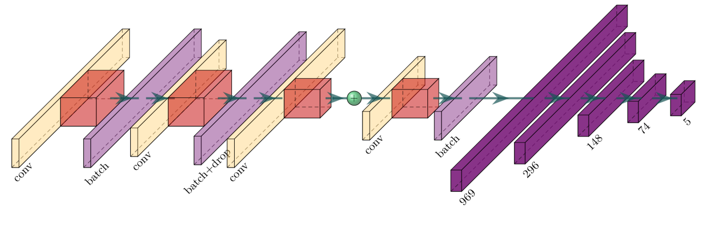
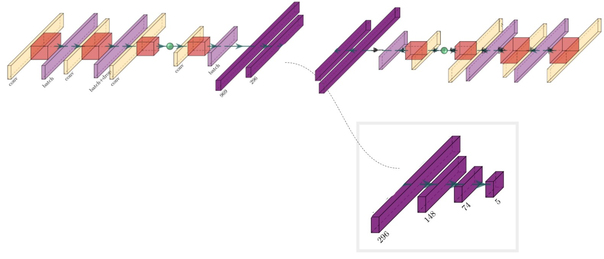
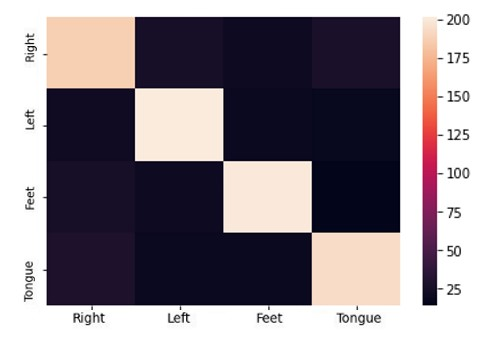

<h1 align="center" > Machine Learning and Deep Learning for Motor Imagery Classification using Electroencephalography </h1>

<h2 align="center" > What is this? </h2>

 A project showcasing the power of deep learning for time series bio-signal classification
- Data
    - BCI competition IV dataset 2a (Tangermann et al.) which contains data from 9 participants for a four class motor imagery paradigm (right hand, left hand, feet, tongue)
        - Motor Imagery is a task where a participant imagines a movement, but does not execute the movement
- Main Experiments
    - Feature extraction and a multi-layer perceptron (MLP)
    - Training a state-of-the-art architecture from scratch
- Results
    - We acheve a Cohen Kappa Coeficcient of 0.72 (~80% accuracy for 4 classes)
        - The best team from the 2008 competition achieved a Cohen Cappa Coeficcient of 0.57
 
- Extra Experiments
    - Feature learning with an autoencoder
    - Transfer learning with a pre-trained architecture

<h3 align="center" > Reference papers </h3>
<h4 align="center" > Architecture </h4>
 
 Mattioli F, Porcaro C, Baldassarre G. <a href="https://iopscience.iop.org/article/10.1088/1741-2552/ac4430">A 1D CNN for high accuracy classification and 
transfer learning in motor imagery EEG-based brain-computer interface </a>. J Neural Eng. 2022 
Jan 6;
18(6). doi: 10.1088/1741-2552/ac4430. PMID: 34920443. 
 

<h4 align="center" > Dataset </h4>

 Michael Tangermann, Klaus-Robert Müller, Ad Aertsen, Niels Birbaumer, Christoph Braun6, Clemens Brunner, Robert Leeb, Carsten Mehring, Kai J. Miller, Gernot R. Müller-Putz, Guido Nolte, Gert Pfurtscheller, Hubert Preissl, Gerwin Schalk, Alois Schlögl, Carmen Vidaurre, Stephan Waldert and Benjamin Blankertz <a href="https://www.frontiersin.org/articles/10.3389/fnins.2012.00055/full">Review of the BCI competition IV </a>. Front. Neurosci., 13 July 2012;
18(6). doi: 10.3389/fnins.2012.00055. 
 

<h2 align="center" > Methods </h2>

<h3 align="center" > Pre-train network for transfer learning</h4>
Following the steps outlined in https://github.com/Kubasinska/MI-EEG-1D-CNN, we train the CNN with ROI-b (Central electrodes). We train with this ROI as this is where the features for motor imagery most strongly appear on the scalp. The weights for this trained classifier are saved in the models/roi_b folder.

<h3 align="center" > Jupyter notebook experiments </h3>

<h4 align="center" > Feature extraction and SVM classification</h4>
We extract spectral features from the Motor Imagery dataset using the python package MNE. We look at all of the channels and a few different frequency bins. Te frequency bins include alpha: 8-13Hz, low beta: 13-20Hz, high beta: 20-30Hz and low gamma: 30-40Hz. The discriminating features for Motor Imagery ususally occur in the alpha and beta frequency range. However, by not using hte information above 40Hz we are giving the CNN a better chance of outperforming, becasue there could be discriminatory information above 40Hz. For the CNN, we pass the network minimally processed raw data.

<h4 align="center" > Training the CNN architecture from scratch</h4>
Here we train the architecture introduced by Mattoli et al. (Hopefulnet) on the BCI competition dataset. The only modifications made to the architecture here is chnging the output layer to only 4 values rather than 5, because this dataset only has 4 classes rather than 5. We use only C1-C2 and C3-C4 electrode pairs becasue we have plenty of data and we would like the best performance possible. Motor Imagery features are usually the most significant in those locations. Most EEG motor imagery features appear in the alpha range (7-13Hz) or even in low beta (13-16Hz). Other features (which could be discriminatory, i.e. EMG) could be incuded if we included higher frequencies. This could be a reason that out CNN outperforms clsasic methods, because it also gets information from higher frequencies.

<h4 align="center" > Feature learning with an autoencoder </h4>
We wanted experiment with more feature learning strategies, so we decided to use an autoencoder to train an encoder with a latent space of 296 values. This autoencoder is eesentially the Hopefulnet architecture but clipped at the end (just after the latent space layer) with a reversed version of the network appended. In order to reverse the network, some layers needed to be changed. The convolutional layers are changed into a transpose convolutional layers, the flatten layers are changed into reshaping layers and the Batch normalization layers needed to be changed into the tensorflow_probability.bijector version. After we train the autoencoder, we extract the encoder network and freeze it. We append an MLP to the encoder and fine-tune the MLP with more data.
This method was unsuccessful, we hypothesize this is becasue the features being encoded to the latent space may be representative of the data, but they may not be discriminative reguarding motor imagery classes.

<h4 align="center" > Transfer learning </h4>
Transfer learning piqued our interest. We load a pre-trained model that has been trained using the steps from Mattoli et al. for ROI_b. We freeze the convolutional layers, so that hopefully the features being extracted are the same as Mattoli et al. which are discriminative for motor imagery classes, as their accuracy was quite impressive. Once the convolutional layers are frozen, we fine-tune the model on new data (from the BCI competition). This method did not surpass the performance of randomly initializing and trianing the model from scratch. This could mean that the features being extracted by the convolutional layers differ between datasets.

<h2 align="center" > Results </h2>

<h4 align="center" > Best performance </h4>
The best performance for classifying the BCI competition dataset came from randomly initializing and training the architecture from Mattoli et al. We acheve a Cohen Kappa Coeficcient of 0.72 (80% accuracy for 4 classes). This is a better performance than any team achieved in the 2008 BCI competition. The best team in 2008 achieved a Cohen Kappa Coefficient of 0.57. However, most teams used classic feature extraction and linear classification methods rather than deep learning, because the field was not as developed as is it now. This goes to show how uesful deep learning can be. Below is a confusion matrix of the best results (Training the CNN architecture from scratch):

