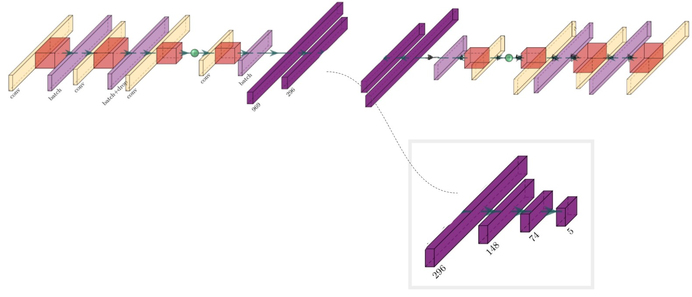
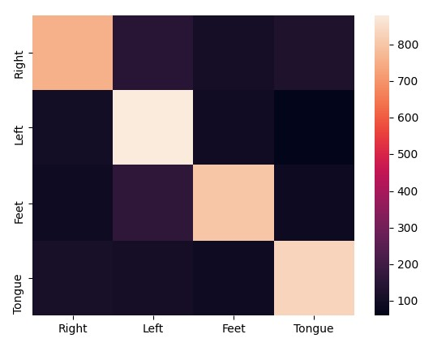

<h1 align="center" > Deep Learning Project </h1>

<h2 align="center" > What is this? </h2>

 A deep learning class project. We experiment using multiple strategies to train a state of the art machine learning architecture to classify 4 differrent motor imagery classes. We use the architecture from Mattoli et al. on a new online dataset (2a) from Tangermann et al. 
 This project was done with a colleague of mine, John Mclinden. He is skilled in Matlab processing so he pre-processed the online dataset. The pre-processed dataset can be found in the Data_For_James folder. I then do some extra pre-processing in preprocessing.py. 
 Here is a link to the project write-up: https://drive.google.com/file/d/1hT70JJ8F9pfgUzSku3Opl6HZnzhzmmhE/view?usp=sharing 
 

<h3 align="center" > Reference papers </h3>
<h4 align="center" > Architecture </h4>
 
 Mattioli F, Porcaro C, Baldassarre G. <a href="https://iopscience.iop.org/article/10.1088/1741-2552/ac4430">A 1D CNN for high accuracy classification and 
transfer learning in motor imagery EEG-based brain-computer interface </a>. J Neural Eng. 2022 
Jan 6;
18(6). doi: 10.1088/1741-2552/ac4430. PMID: 34920443. 
 

<h4 align="center" > Dataset </h4>

 Michael Tangermann, Klaus-Robert Müller, Ad Aertsen, Niels Birbaumer, Christoph Braun6, Clemens Brunner, Robert Leeb, Carsten Mehring, Kai J. Miller, Gernot R. Müller-Putz, Guido Nolte, Gert Pfurtscheller, Hubert Preissl, Gerwin Schalk, Alois Schlögl, Carmen Vidaurre, Stephan Waldert and Benjamin Blankertz <a href="https://www.frontiersin.org/articles/10.3389/fnins.2012.00055/full">Review of the BCI competition IV </a>. Front. Neurosci., 13 July 2012;
18(6). doi: 10.3389/fnins.2012.00055. 
 

<h2 align="center" > Methods </h2>

<h3 align="center" > Pre-train network </h3>
Following the steps outlined in https://github.com/Kubasinska/MI-EEG-1D-CNN, we train the Convolutional Neural Network with ROI-b (Central electrodes). We train with this ROI as this is where the features for motor imagery most strongly appear on the scalp. We also use this ROI for testing with the online dataset. The weights for this trained classifier are saved in the models/roi_b folder.

<h3 align="center" > Pre-process data </h3>

The data was already pre-processed by John (filtering and epochs created), however, some preprocessing was also done in preprocessing.py. This includes Common Average Referencing, trimming the epochs to 4 seconds, resampling the data and organizing it into an ideal format

<h3 align="center" > Jupyter notebook experiments </h3>

<h4 align="center" > Training the CNN architecture </h4>
Here we train the architecture introduced by Mattoli et al. on the BCI competition dataset. THe only modicifations made to the arhitecture here is chnging the output layer to only 4 values rather than 5, because this dataset only has 4 classes rather than 5.

<h4 align="center" > Feature learning with an autoencoder </h4>
We wanted to look into end to end learning, so we decided to use an autoencoder to train an encoder with a latent space of 296 values. This autoencoder is eesentially the Hopefulnet architecture but clipped at the end (jsut after the latent space layer) and a reversed version of the network. In order to reverse the network, some layers needed to be changed. The convolutional layers are changed into a transpose convolutional layers, the flatten layers are changed into reshaping layers and the Batch normalization layers needed to be changed into the tensorflow_probability.bijector version. After we train the autoencoder, we extract teh encoder network and freeze it. We append an MLP to the encoder and fine-tune the model with more data.
This method was unsuccessful, we hypothesize this is becasue the features being encoded to the latent space may be representative of the data, but they may not be discriminative reguarding motor imagery classes.

<h4 align="center" > Transfer learning </h4>
Transfer learning piqued our interest. We load a pre-trained model that has been trained using the steps from Mattoli et al. for ROI_b. We freeze the convolutional layers, so that hopefully the features being extracted are the same as Mattoli et al. which are discriminative for motor imagery classes, as their accuracy was quite impressive. Once the convolutional layers are frozen, we fine-tune the model on new data (from the BCI competition). This method did not surpass the performance of randomly initializing and trianing the model from scratch. This could mean that the features being extracted by the convolutional layers differ between datasets. A possible reason for this is that we have different pre-processing steps. We filtered our data more conservatively, using a lowpass cutoff frequency of 50 Hz rather than 70 Hz. We did this because most EEG motor imagery features appear in the alpha range (7-13Hz) or even in low beta (13-16Hz). Other features (which could be discriminatory, i.e. EMG) could be incuded if we included higher frequencies. Other experiments are being done using identical preprocessing steps to further this hypothesis.

<h4 align="center" > Best performance </h4>
The best performance for classifying the BCI competition dataset came from randomly initializing and training the architecture from Mattoli et al. We acheve a Cohen Kappa Coeficcient of 0.626 (72% accuracy for 4 classes). This is a better performance than any team achieved in the 2008 BCI competition. However, most teams used classic feature extraction and linear classification methods rather than deep learning. This goes to show how uesful deep learning can be. Below is a confusion matrix of the final results:

